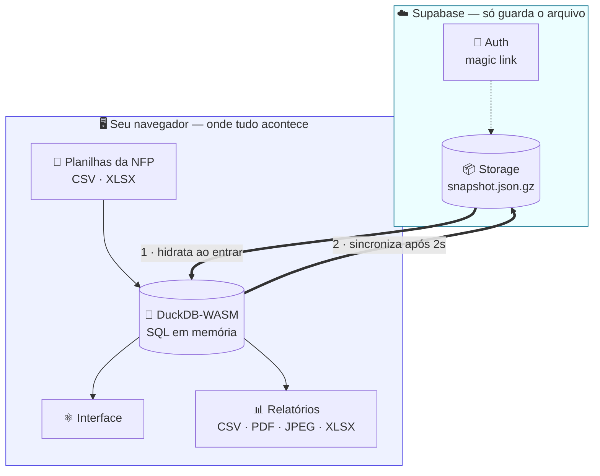
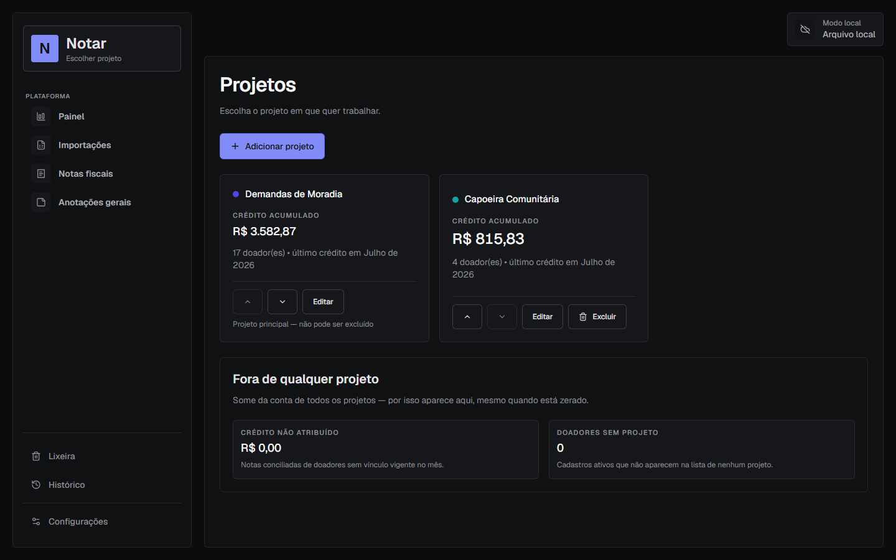
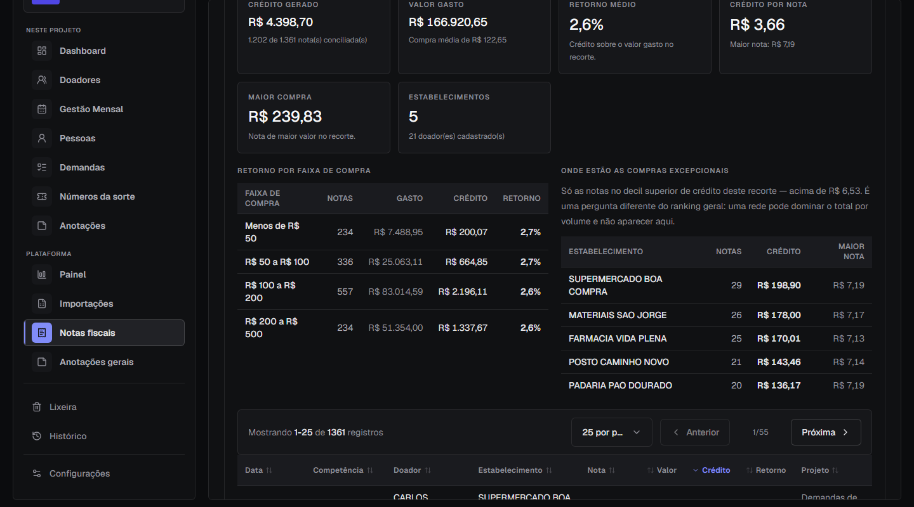
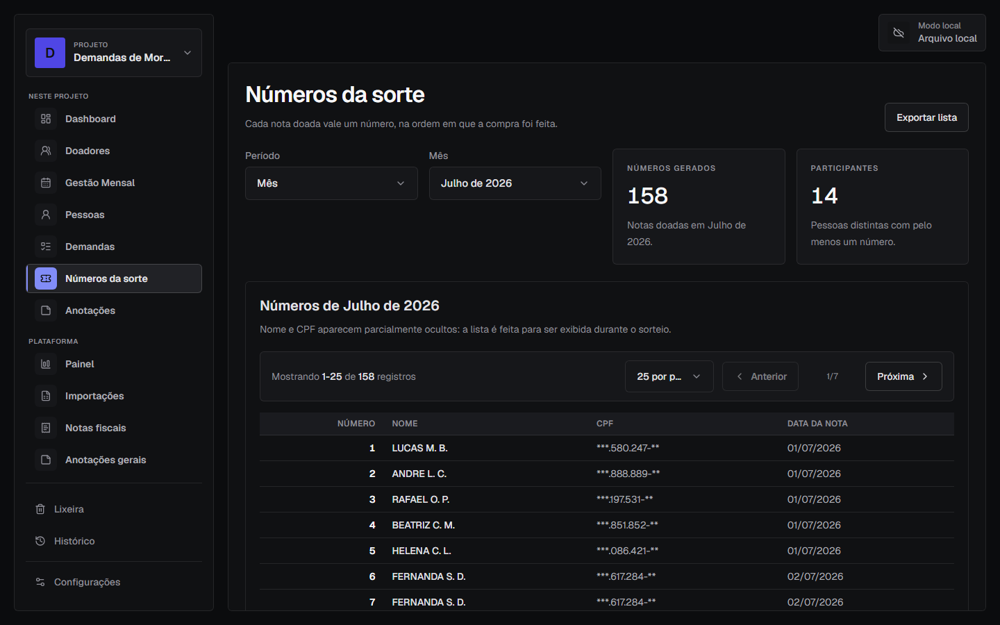
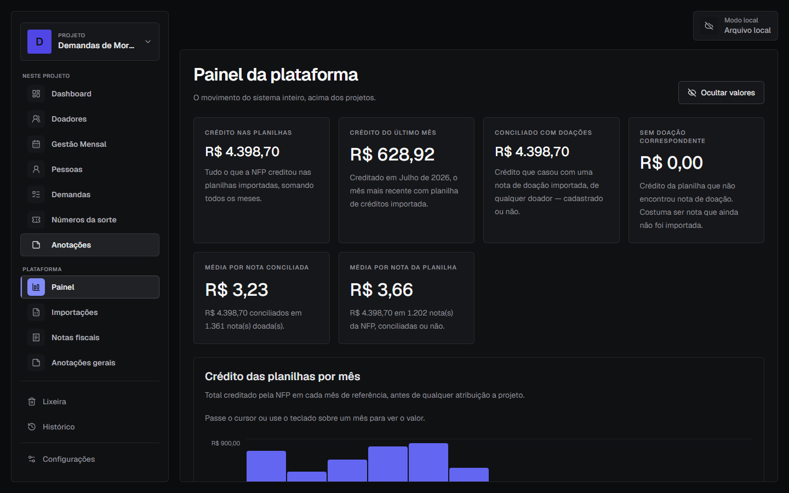
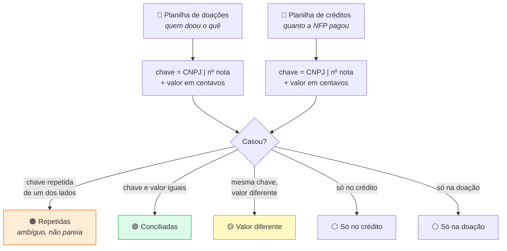
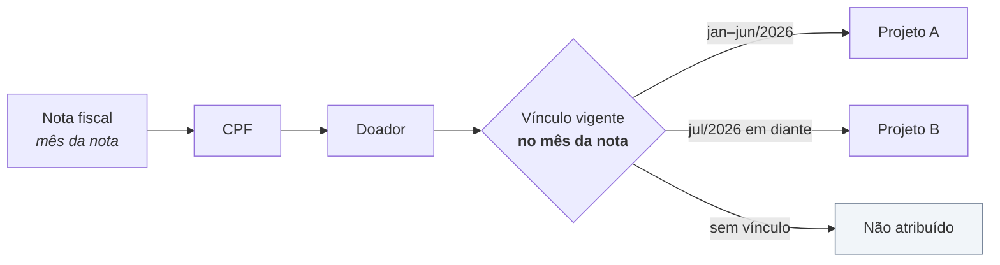
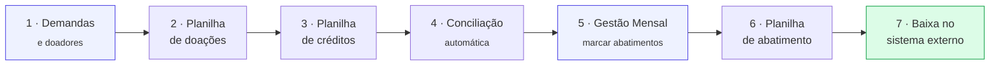

<div align="center">

# Notar

**Plataforma local-first para ONGs que arrecadam pela Nota Fiscal Paulista.**
Cadastro de doadores, importação das planilhas da NFP, conciliação nota a nota,
apuração mensal de abatimentos e relatórios — tudo rodando no navegador.

[](https://github.com/LPac1n1/notar/actions/workflows/ci.yml)


</div>

---

## Índice

- [O que é](#o-que-é)
- [Como funciona](#como-funciona)
- [Telas](#telas)
- [Funcionalidades](#funcionalidades)
- [Os três conceitos que explicam o resto](#os-três-conceitos-que-explicam-o-resto)
- [Instalação](#instalação)
- [Configuração de ambiente](#configuração-de-ambiente)
- [Como usar](#como-usar)
- [Arquitetura](#arquitetura)
- [Scripts e testes](#scripts-e-testes)
- [Limitações conhecidas](#limitações-conhecidas)
- [Contribuição](#contribuição)
- [Licença](#licença)

---

## O que é

Quem doa nota fiscal para uma ONG pelo programa da **Nota Fiscal Paulista** gera
crédito para ela. Todo mês a NFP publica duas planilhas: uma com as **doações**
recebidas e outra com os **créditos** liberados. Conferir uma contra a outra,
descobrir quem doou quanto, calcular o abatimento de cada pessoa e dar baixa no
sistema da entidade é um trabalho manual, repetitivo e fácil de errar.

O Notar faz esse ciclo inteiro. E faz **sem servidor**: o banco de dados roda
dentro do seu navegador, e a nuvem serve só para guardar um arquivo e sincronizar
entre dispositivos.

> **Por que local-first?** Uma ONG pequena não deve precisar manter servidor,
> banco e backup para conferir uma planilha. Aqui a máquina de quem usa é o
> servidor — e o custo de infraestrutura é uma conta gratuita de storage.

---

## Como funciona

O dado nunca sai do navegador para ser processado. O que vai para a nuvem é um
**snapshot comprimido** do banco inteiro, e ele volta na próxima vez que você
entra.



**Nenhuma consulta viaja pela rede.** Filtros, agregações, conciliação e
relatórios são SQL executado localmente pelo DuckDB. A rede é usada em três
momentos apenas: entrar, sincronizar e sair.

---

## Telas

<table>
  <tr>
    <td width="50%"><b>Escolha de projeto</b><br/><sub>A plataforma abre pelos projetos, cada um com seus próprios doadores e números.</sub><br/><br/></td>
    <td width="50%"><b>Gestão mensal</b><br/><sub>Apuração do mês: abatimento por doador, crédito real e saldo.</sub><br/><br/></td>
  </tr>
  <tr>
    <td width="50%"><b>Importações e conciliação</b><br/><sub>As duas planilhas do mês lado a lado e o estado do casamento entre elas.</sub><br/><br/></td>
    <td width="50%"><b>Doadores</b><br/><sub>Titulares, auxiliares, CPFs vinculados e início das doações.</sub><br/><br/></td>
  </tr>
  <tr>
    <td width="50%"><b>Notas fiscais</b><br/><sub>Inteligência sobre a nota individual: faixas de valor, estabelecimentos, retorno.</sub><br/><br/></td>
    <td width="50%"><b>Números da sorte</b><br/><sub>Cada nota doada vira um número, na ordem da compra — para sorteios.</sub><br/><br/></td>
  </tr>
  <tr>
    <td colspan="2"><b>Painel da plataforma</b><br/><sub>O movimento do sistema inteiro, acima dos projetos — inclusive a parte que não pertence a nenhum.</sub><br/><br/></td>
  </tr>
</table>

---

## Funcionalidades

<table>
<tr><td valign="top" width="50%">

**📁 Projetos**
- Vários projetos na mesma conta, cada um com seus doadores
- Módulos ligáveis por projeto (apuração mensal, demandas, pessoas…)
- Transferência de doador entre projetos preservando o histórico

**👥 Cadastros**
- Pessoas, doadores titulares, auxiliares e demandas
- Vários CPFs por doador
- Busca por texto livre — nome, CPF ou demanda — em todas as listas
- Descoberta automática do início das doações a partir do CPF

</td><td valign="top" width="50%">

**📥 Importação e conciliação**
- Planilhas de **doações** e de **créditos** (CSV, TXT, XLSX)
- Pré-visualização com detecção automática de colunas
- Conciliação nota a nota por `(CNPJ, número, valor)`
- Reimportação para corrigir um mês já importado
- Diagnóstico de "por que meus créditos não casaram?"

**📊 Apuração mensal**
- Abatimento por doador, status e ações em massa
- Crédito real e saldo **do mês** de referência
- Lançamento acumulado cobrindo vários meses
- Rastreio de quem parou de doar, com meses seguidos

</td></tr>
<tr><td valign="top">

**📤 Exportação**
- Planilha de abatimento no formato exato do sistema de baixa, uma por demanda
- Relatórios PDF e JPEG por demanda
- CSVs de doadores, resumo mensal, conciliação e números da sorte
- ZIP automático quando há mais de uma demanda

</td><td valign="top">

**🔒 Dados e privacidade**
- Backup e restauração em JSON
- Sincronização entre dispositivos com detecção de alteração remota
- Botão de ocultar valores, para usar o sistema com gente por perto
- Nome e CPF mascarados na lista de sorteio

</td></tr>
</table>

---

## Os três conceitos que explicam o resto

Se você for ler só uma seção antes de mexer no código, leia esta.

<details open>
<summary><b>1. A conciliação casa duas planilhas por uma chave que ignora a data</b></summary>

<br/>

A NFP publica doações e créditos separadamente. O Notar casa nota a nota usando
**CNPJ + número da nota + valor em centavos**. A data ficou de fora de propósito:
as duas planilhas divergem na data com frequência, e usá-la gerava divergência
onde não havia nenhuma.



As repetidas vêm **primeiro**: uma nota cuja chave aparece duas vezes é ambígua,
e escolher um par para ela seria arbitrário. O sistema prefere expor o problema
a esconder um palpite.

</details>

<details>
<summary><b>2. O projeto é uma dimensão de atribuição, não uma partição de dados</b></summary>

<br/>

Todos os projetos compartilham o **mesmo CNPJ recebedor**. Existe uma planilha
só, uma importação só, uma conciliação só. O projeto não vem do arquivo — vem do
**vínculo doador → projeto, com vigência em mês**.



Consequência prática: transferir um doador **não reescreve o passado**. O crédito
de março continua somando para o projeto que era dele em março. E o crédito de
quem não tem vínculo aparece como *não atribuído* em vez de sumir — o invariante
que o sistema mantém é:

> `Σ(por projeto) + Σ(não atribuído) = Σ(conciliado)`

</details>

<details>
<summary><b>3. Titular e auxiliar doam separado, mas o abatimento é do titular</b></summary>

<br/>

Uma família costuma doar por vários CPFs. Cada um tem seu cadastro e sua
contagem de notas — o auxiliar **nunca** tem as notas somadas às do titular no
resumo. Mas o sistema externo que dá baixa abate na conta de quem responde pelo
grupo, então na planilha de abatimento a linha do auxiliar sai com o **nome e o
CPF do titular**, e a descrição identifica de quem são aquelas notas.

| | Resumo mensal | Planilha de abatimento |
|---|---|---|
| **Titular** (12 notas) | linha própria, 12 | `MARIA SILVA` · 12 · *"Doações NFP - MARIA SILVA - Abr/2026"* |
| **Auxiliar** (5 notas) | linha própria, 5 | `MARIA SILVA` · 5 · *"Doações NFP - JOÃO AUXILIAR - Abr/2026"* |

</details>

---

## Instalação

**Pré-requisitos:** Node.js 20+ e npm. Para os testes e2e, também
`npx playwright install`.

```bash
git clone https://github.com/LPac1n1/notar.git
cd notar

# O postinstall prepara o worker local do DuckDB-WASM
npm install

cp .env.example .env   # preencha (ver abaixo)
npm run dev
```

---

## Configuração de ambiente

O Notar usa um projeto no **Supabase** para autenticação e para guardar o
snapshot.

<details>
<summary><b>Passo a passo no painel do Supabase</b></summary>

<br/>

1. Crie um projeto em [supabase.com](https://supabase.com).
2. Em **Storage**, crie um bucket **privado** chamado `notar`.
3. Aplique o template de policies **"Give users access to own folder"** no
   bucket, restrito a usuários `authenticated`.
4. Em **Auth → Providers → Email**, desative *Confirm email*.
5. Em **Auth → URL Configuration**, adicione `http://localhost:5173` em
   **Site URL** e em **Redirect URLs**.

As chaves ficam em **Project Settings → API**.

</details>

```env
VITE_SUPABASE_URL=https://seu-projeto.supabase.co
VITE_SUPABASE_ANON_KEY=sua-chave-publica
VITE_SUPABASE_STORAGE_BUCKET=notar
VITE_SUPABASE_STORAGE_OBJECT=dados.json

# Opcional — ver aviso abaixo
VITE_NOTAR_AUTH_MODE=
```

> [!NOTE]
> O `.env` já está no `.gitignore`. A chave pública no frontend é por desenho:
> quem controla o acesso de verdade são as policies do bucket, por pasta de
> usuário.

> [!WARNING]
> **`VITE_NOTAR_AUTH_MODE=local` desliga a persistência.** Nesse modo o Supabase
> nem é inicializado: não há login **nem sincronização**, o banco fica só em
> memória e **tudo some ao recarregar a página**. É o modo que a suíte e2e usa.
> Se o app "esquece" tudo a cada refresh, procure essa variável em algum `.env`.

---

## Como usar

O acesso é por **magic link** — você informa o e-mail e entra pelo link
recebido, sem senha.



<details>
<summary><b>Detalhes que evitam retrabalho</b></summary>

<br/>

- **O valor por nota fica salvo por importação.** Para corrigir, use
  *Reimportar* na própria linha do mês — ela substitui as notas em vez de somar.
- **Meses cobertos por um acumulado** aparecem como *"Via acumulado"* e não podem
  ser marcados individualmente: o valor já foi contabilizado no mês do acumulado.
- **As divergências de conciliação vêm das planilhas da própria NFP** e não são
  corrigíveis pelo app. O número é informativo, não uma tarefa.
- **Agência e conta** da planilha de abatimento saem como `1`, e entram na chave
  única do sistema de destino: mudar esse valor muda a chave de todas as linhas.
- **A data da planilha de abatimento** é o último dia do terceiro mês após a
  competência (abril → 31/07). É derivada da competência, então reexportar o
  mesmo mês produz sempre a mesma chave.
- A sincronização acontece sozinha, com atraso de 2s após cada alteração.

</details>

---

## Arquitetura

**Local-first, sem API própria.** Não há endpoints, contratos de resposta nem
paginação de rede para manter — o que existiria nessa camada aqui é SQL.

| Camada | Responsabilidade |
|---|---|
| `pages/` | Estado, carregamento e handlers. Sem regra de negócio. |
| `features/<domínio>/` | Componentes e hooks de um domínio específico. |
| `components/ui/` | Primitivos genéricos e reutilizáveis. |
| `services/` | Regra de negócio, persistência e processamento. |
| `services/db/` | Conexão, schema, migrations e sincronização. |
| `utils/` | Funções puras e formatação. |
| `hooks/` | Hooks reutilizáveis, desacoplados de domínio. |

**Convenções que o código segue por toda parte:**

- **Migrations versionadas.** O schema é construído por migrations
  incrementais com uma tabela `schema_version` que registra o que já foi
  aplicado.
- **SQL parametrizado.** Todo valor que toca SQL vai por prepared statement.
  Onde o DuckDB não aceita parâmetro (nome de coluna, `ORDER BY`, caminho de
  arquivo), o valor passa por lista fechada ou é gerado internamente.
- **SQL em módulo puro.** As consultas mais delicadas moram em arquivos
  `*Sql.js` sem nenhum import, para o teste de integração rodar a **consulta de
  produção** contra o DuckDB em vez de espelhá-la e divergir com o tempo.

<details>
<summary><b>Estrutura de pastas</b></summary>

<br/>

```
src/
├── components/       # UI compartilhada
│   ├── ui/           # Primitivos (Button, Modal, DataTable…)
│   ├── layout/       # Barra lateral, cabeçalho, transições
│   ├── auth/         # Tela de acesso
│   ├── project/      # Seletor e guarda de projeto
│   └── sync/         # Aviso de alteração remota
├── contexts/         # Providers (auth, projeto)
├── features/         # Agrupado por domínio
│   ├── credits/      dashboard/   demands/   donors/
│   ├── history/      imports/     monthly/   notes/
│   ├── notesAnalytics/  people/   projects/  reports/
├── hooks/            # useDataResource, useMutationAction, usePagination…
├── pages/            # Uma por rota
├── routes/           # Rotas e redirecionamentos legados
├── services/         # Domínio e persistência
│   ├── db/           # Conexão, schema, migrations, snapshot, nuvem
│   ├── import/       credit/      monthly/   reconciliation/
│   ├── donor/        project/     raffle/    notes/
│   ├── dashboard/    establishment/
├── utils/            # Puros: cpf, data, formato, máscara, csv…
└── vendor/           # Worker do DuckDB versionado

e2e/       # Playwright — fluxos ponta a ponta
tests/     # node:test — puros + integração real com DuckDB-Node
docs/      # Capturas usadas neste README
scripts/   # Utilitários de build
```

</details>

---

## Scripts e testes

| Script | O que faz |
|---|---|
| `npm run dev` | Servidor de desenvolvimento |
| `npm run build` | Build de produção |
| `npm run preview` | Serve a build localmente |
| `npm run lint` | ESLint |
| `npm run test` | Testes unitários e de integração (`node --test`) |
| `npm run test:e2e` | Testes ponta a ponta (Playwright) |

**Antes de enviar mudanças:**

```bash
npm run lint && npm run test && npm run build
```

Para mudanças em navegação, importação ou persistência, rode também
`npm run test:e2e`.

| Suíte | O que cobre |
|---|---|
| `tests/*.test.js` | Funções puras e **integração real contra DuckDB-Node**: migrations, prepared statements e as consultas de negócio mais delicadas. |
| `e2e/*.spec.js` | Fluxos no navegador: importação, reimportação, apuração, sorteio, backup, responsividade e o autosave das anotações. |

O CI roda em push para `main` e em pull requests, com dois jobs paralelos:
`checks` (lint + testes + build) e `e2e` (Chromium, com relatório publicado como
artefato quando falha).

> [!TIP]
> A suíte unitária usa o bundle **node-blocking (MVP)** do DuckDB-WASM, que
> quebra com `_setThrew is not defined` em alguns construtos — notadamente
> `LIKE '%' || ? || '%'` dentro de prepared statement. Quando esbarrar nisso,
> cubra o SQL gerado com teste unitário e valide o comportamento pelo e2e, que
> roda o bundle EH de produção.

---

## Limitações conhecidas

| Limitação | Detalhe |
|---|---|
| **Navegador** | Depende de WebAssembly com *exception handling*: Chrome/Edge 95+, Firefox 100+, Safari 15.2+. |
| **Edição simultânea** | A sincronização é por snapshot, então dois dispositivos editando ao mesmo tempo caem em "último a sincronizar vence". O app detecta alteração remota ao voltar para a aba e oferece recarregar antes de sobrescrever — mas não faz merge. |
| **Volumes grandes** | Doadores, Pessoas, Lixeira, Histórico e Notas fiscais paginam no servidor. **Gestão Mensal ainda pagina no cliente**: acima de ~5 mil linhas num único mês a página fica lenta. A infraestrutura já existe; a migração foi adiada por ser a página de maior risco. |
| **Sem perfis de acesso** | Não há API própria nem permissão por papel. Quem entra na conta enxerga e edita tudo. |
| **Sincronização integral** | Cada gravação reescreve o snapshot inteiro. Com um ano de uso o arquivo comprimido fica em ~0,34 MB, então o custo é desprezível; a sincronização incremental está planejada para quando passar de 5 MB. |

---

## Contribuição

1. Crie uma branch a partir da principal.
2. Faça mudanças pequenas e focadas.
3. Preserve compatibilidade com dados, backups e fluxos existentes.
4. Rode lint, testes e build antes de abrir a contribuição.
5. Inclua testes ao mexer em regra de negócio, cálculo, importação ou persistência.

**Commits** são curtos e numerados — o conteúdo da mudança fica no diff:

```
commit 292
```

Cada commit é uma unidade fechada, que passa em lint, testes e build por si só.
Escopos diferentes vão em commits separados.

---

## Licença

Este projeto ainda não tem licença definida. Antes de distribuir publicamente ou
permitir uso por terceiros, escolha uma e adicione o arquivo `LICENSE` ao
repositório.
