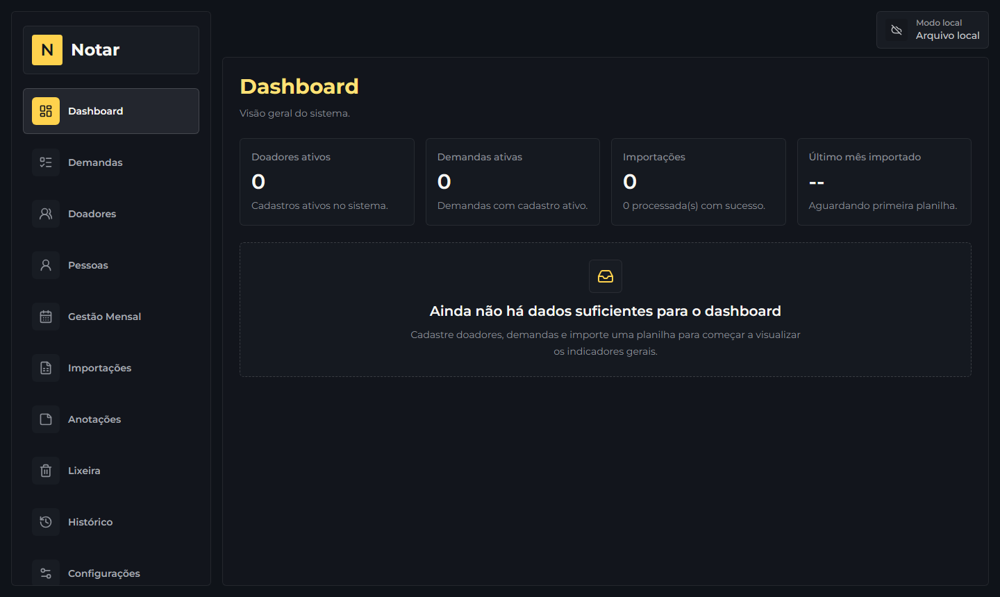
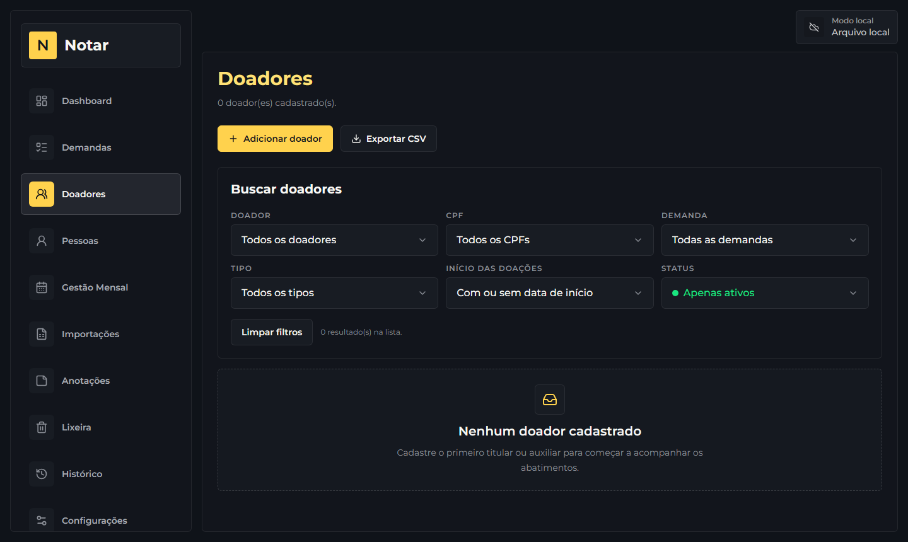
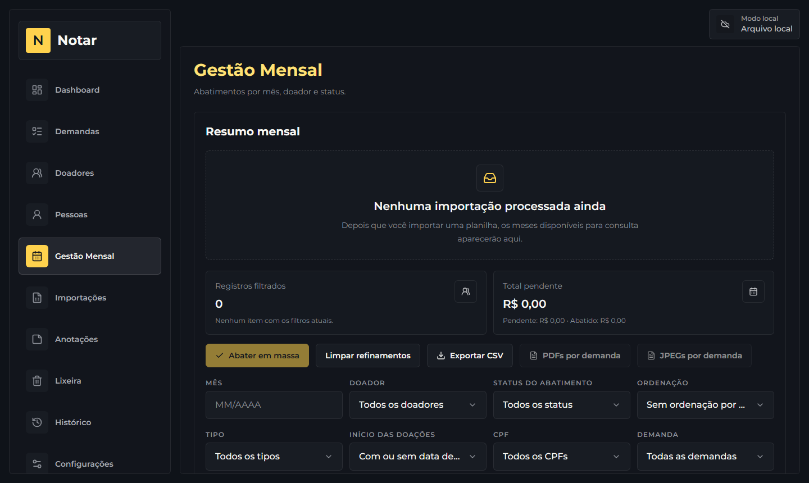
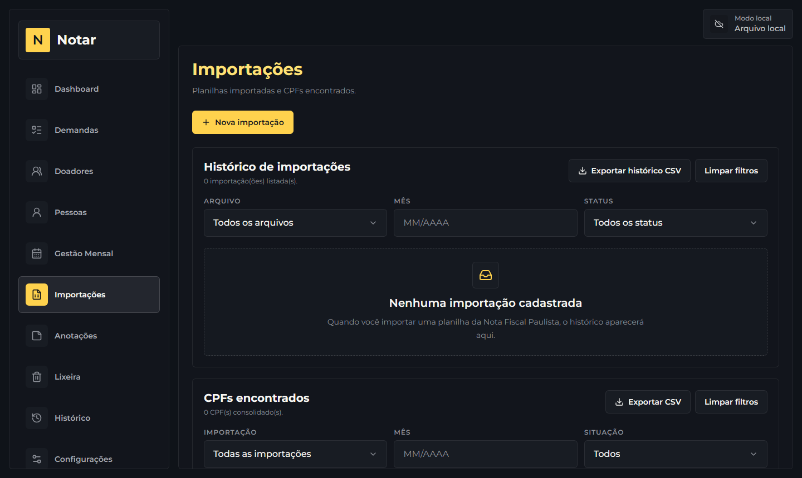

# Notar

Sistema web para gestão de doadores da Nota Fiscal Paulista — cadastro, importação de CPFs, cálculo de abatimentos e exportação de relatórios para ONGs.


## Sumário

- [Sobre o Projeto](#sobre-o-projeto)
- [Tecnologias](#tecnologias)
- [Funcionalidades](#funcionalidades)
- [Pré-requisitos](#pré-requisitos)
- [Instalação](#instalação)
- [Configuração de Ambiente](#configuração-de-ambiente)
- [Como Usar](#como-usar)
- [Estrutura de Pastas](#estrutura-de-pastas)
- [Padrões e Arquitetura](#padrões-e-arquitetura)
- [Scripts Disponíveis](#scripts-disponíveis)
- [Limitações Conhecidas](#limitações-conhecidas)
- [Contribuição](#contribuição)
- [Licença](#licença)

---

## Preview

| Dashboard | Doadores |
|---|---|
|  |  |

| Gestão Mensal | Importações |
|---|---|
|  |  |

---

## Sobre o Projeto

O **Notar** é uma aplicação web local-first voltada para ONGs ligadas a demandas de moradia. Centraliza o cadastro de doadores, cruza CPFs importados da Nota Fiscal Paulista, calcula abatimentos mensais e gera relatórios em PDF e CSV.

Toda a lógica de dados roda no navegador via **DuckDB-WASM** — sem servidor próprio, sem banco remoto. Os dados são sincronizados entre dispositivos via **Supabase Storage**, com autenticação por magic link.

---

## Tecnologias

**Front-end**
- [React 19](https://react.dev) + [Vite 8](https://vitejs.dev)
- [React Router v7](https://reactrouter.com)
- [Tailwind CSS 4](https://tailwindcss.com)
- [Framer Motion](https://www.framer.com/motion) — animações
- [Lucide React](https://lucide.dev) — ícones

**Banco de dados / Processamento**
- [DuckDB-WASM](https://duckdb.org/docs/api/wasm/overview.html) — SQL no navegador via OPFS / File System Access API
- [ExcelJS](https://github.com/exceljs/exceljs) — leitura de arquivos `.xlsx`

**Autenticação / Sincronização**
- [Supabase](https://supabase.com) — autenticação (magic link) + cloud storage

**Qualidade / Testes**
- [ESLint 9](https://eslint.org)
- [Node Test Runner](https://nodejs.org/api/test.html) — testes unitários
- [Playwright](https://playwright.dev) — testes end-to-end

---

## Funcionalidades

- Cadastro de pessoas, doadores titulares, doadores auxiliares e demandas
- Importação de planilhas da Nota Fiscal Paulista (CSV, TXT, XLSX) com pré-visualização e seleção de coluna
- Conciliação automática de CPFs importados com doadores cadastrados
- Gestão mensal com filtros, cálculo de abatimentos e status de realização
- Dashboard com indicadores e alertas operacionais
- Exportação de CSVs e relatórios PDF por demanda (ZIP automático para múltiplas demandas)
- Backup e restauração local de dados em JSON
- Sincronização entre dispositivos via Supabase
- Autenticação por magic link (sem senha)

---

## Pré-requisitos

- **Node.js 20+** e **npm**
- Conta no [Supabase](https://supabase.com) com projeto configurado (ver [Configuração de Ambiente](#configuração-de-ambiente))

Para testes end-to-end, instale os navegadores do Playwright:

```bash
npx playwright install
```

---

## Instalação

```bash
# 1. Clone o repositório
git clone <url-do-repositório>
cd notar

# 2. Instale as dependências
# O postinstall prepara automaticamente o worker local do DuckDB-WASM
npm install

# 3. Configure as variáveis de ambiente (ver seção abaixo)
cp .env.example .env

# 4. Inicie o servidor de desenvolvimento
npm run dev
```

Acesse a URL exibida pelo Vite no terminal.

---

## Configuração de Ambiente

O projeto requer um projeto no **Supabase** para autenticação e sincronização de dados.

### 1. Configurar o projeto no Supabase

1. Crie um projeto em [supabase.com](https://supabase.com).
2. Em **Storage**, crie um bucket privado chamado `notar`.
3. Aplique o template de policies **"Give users access to own folder"** no bucket, restrito a usuários `authenticated`.
4. Em **Auth → Providers → Email**, desative "Confirm email".
5. Em **Auth → URL Configuration**, adicione `http://localhost:5173` em **Site URL** e **Redirect URLs**.

### 2. Preencher o `.env`

```env
VITE_SUPABASE_URL=https://your-project.supabase.co
VITE_SUPABASE_ANON_KEY=your-publishable-anon-key
VITE_SUPABASE_STORAGE_BUCKET=notar
VITE_SUPABASE_STORAGE_OBJECT=dados.json

# Opcional: defina como "local" para pular a autenticação em desenvolvimento
VITE_NOTAR_AUTH_MODE=
```

As chaves `VITE_SUPABASE_URL` e `VITE_SUPABASE_ANON_KEY` estão em **Supabase → Project Settings → API**.

> O `.env` já está no `.gitignore`. Nunca versione credenciais reais.

---

## Como Usar

### Autenticação

O Notar usa **magic link** — sem senha. Informe seu e-mail na tela de login e acesse o link enviado para entrar.

> Em desenvolvimento, defina `VITE_NOTAR_AUTH_MODE=local` no `.env` para abrir o app sem autenticação.

### Fluxo de trabalho recomendado

1. Cadastre as **demandas** (com cores de identificação).
2. Cadastre **pessoas** de referência, se necessário.
3. Cadastre **doadores titulares** e **auxiliares** com seus CPFs.
4. Importe a **planilha mensal** da Nota Fiscal Paulista (CSV, TXT ou XLSX).
5. Informe o mês de referência, o valor por nota e a coluna de CPF.
6. Confira os CPFs encontrados e os vínculos com doadores na tela de importação.
7. Acompanhe os abatimentos em **Gestão Mensal**.
8. Marque abatimentos como pendentes ou realizados.
9. Exporte **CSVs** ou **relatórios PDF** por demanda quando necessário.
10. Use **Configurações** para exportar backup, restaurar dados ou sincronizar manualmente.

### Observações

- Titulares e auxiliares têm abatimentos independentes.
- O vínculo de um auxiliar é informativo e não transfere abatimento ao titular.
- O valor por nota fica salvo por importação. Para corrigir, exclua a importação e reimporte.
- Os dados são sincronizados automaticamente com debounce de 2s após cada transação.

---

## Estrutura de Pastas

```
src/
├── assets/           # Arquivos estáticos
├── components/       # Componentes compartilhados de UI e layout
│   ├── auth/         # Componentes de autenticação
│   └── sync/         # Componentes de sincronização cloud
├── constants/        # Constantes e opções de filtro compartilhadas
├── contexts/         # Context providers (auth)
├── features/         # Componentes e serviços agrupados por domínio
│   ├── dashboard/
│   ├── demands/
│   ├── donors/
│   ├── history/
│   ├── imports/
│   ├── monthly/
│   ├── notes/
│   └── people/
├── hooks/            # Hooks reutilizáveis desacoplados de domínio
├── pages/            # Páginas e orquestração de fluxos
├── routes/           # Configuração de rotas
├── services/         # Persistência, importação, exportação e regras de domínio
│   └── db/           # Módulos do banco (schema, migrations, cloud storage)
├── styles/           # Estilos globais
├── utils/            # Utilitários puros e helpers compartilhados
└── vendor/           # Arquivos de terceiros versionados
```

Pastas auxiliares:

```
e2e/      # Testes end-to-end (Playwright)
tests/    # Testes unitários (node:test) + integração com DuckDB-Node
scripts/  # Scripts auxiliares do projeto
public/   # Arquivos públicos servidos pelo Vite
```

---

## Padrões e Arquitetura

**Local-first:** toda a lógica de dados roda no browser via DuckDB-WASM. O Supabase é usado exclusivamente para autenticação e armazenamento do snapshot JSON — não há queries remotas.

**Separação de responsabilidades:**

| Camada | Responsabilidade |
|---|---|
| `pages/` | Estado, carregamento e handlers. Sem lógica de negócio. |
| `features/<domínio>/components/` | Componentes específicos de domínio. |
| `components/ui/` | Componentes genéricos e reutilizáveis. |
| `services/` | Regras de negócio, persistência e processamento. |
| `utils/` | Funções puras, formatações e helpers compartilhados. |
| `hooks/` | Hooks reutilizáveis desacoplados de domínio. |

**Migrations versionadas:** o schema do DuckDB é gerenciado por migrations incrementais em `services/db/migrations.js`, com tabela `schema_version` para rastreamento de versão aplicada.

**SQL seguro:** queries com input do usuário usam prepared statements (`queryPrepared` / `executePrepared`). Identificadores de coluna são validados por whitelist antes de serem interpolados no SQL.

**Boas práticas:**
- Evite lógica de negócio dentro de componentes visuais.
- Prefira refatorações incrementais compatíveis com dados existentes.
- Não adicione dependências sem necessidade clara.
- Mantenha nomes de arquivos e componentes consistentes com o padrão já adotado.

---

## Scripts Disponíveis

| Script | Descrição |
|---|---|
| `npm run dev` | Inicia o servidor local de desenvolvimento |
| `npm run build` | Gera a build de produção |
| `npm run preview` | Serve localmente a build gerada |
| `npm run lint` | Executa o ESLint |
| `npm run test` | Executa os testes unitários com `node --test` |
| `npm run test:e2e` | Executa os testes end-to-end com Playwright |
| `npm run prepare:duckdb-worker` | Prepara o worker local do DuckDB-WASM |

**Validação recomendada antes de enviar mudanças:**

```bash
npm run lint && npm run test && npm run build
```

Para alterações que envolvam navegação, importação ou persistência:

```bash
npm run test:e2e
```

---

## Limitações Conhecidas

- **Compatibilidade de navegador:** o app depende de OPFS (Origin Private File System) e da File System Access API. Requer Chrome 86+, Edge 86+ ou Firefox 111+. **Não funciona no Safari.**
- **Ambiente local:** o app é projetado para uso em rede local ou por um único usuário por vez. Edições simultâneas por múltiplos dispositivos resultam na estratégia de "último a sincronizar vence".
- **Volumes grandes:** a paginação server-side está disponível na infraestrutura mas ainda não ativada nas páginas. Para bases acima de ~5 mil linhas, listas podem ficar lentas.

---

## Contribuição

1. Crie uma branch a partir da base principal.
2. Faça mudanças pequenas e focadas.
3. Preserve compatibilidade com dados, backups e fluxos existentes.
4. Rode lint, testes e build antes de abrir a contribuição.
5. Inclua testes ao alterar regras de negócio, cálculos, importações ou persistência.

**Padrão de commits:**

```
tipo: descrição curta
```

| Tipo | Uso |
|---|---|
| `feat` | Nova funcionalidade |
| `fix` | Correção de bug |
| `refactor` | Refatoração sem mudança de comportamento |
| `docs` | Documentação |
| `test` | Testes |
| `chore` | Tarefas de manutenção |

---

## Licença

Este projeto ainda não possui uma licença definida. Antes de distribuir publicamente ou permitir uso por terceiros, defina e adicione um arquivo de licença ao repositório.
